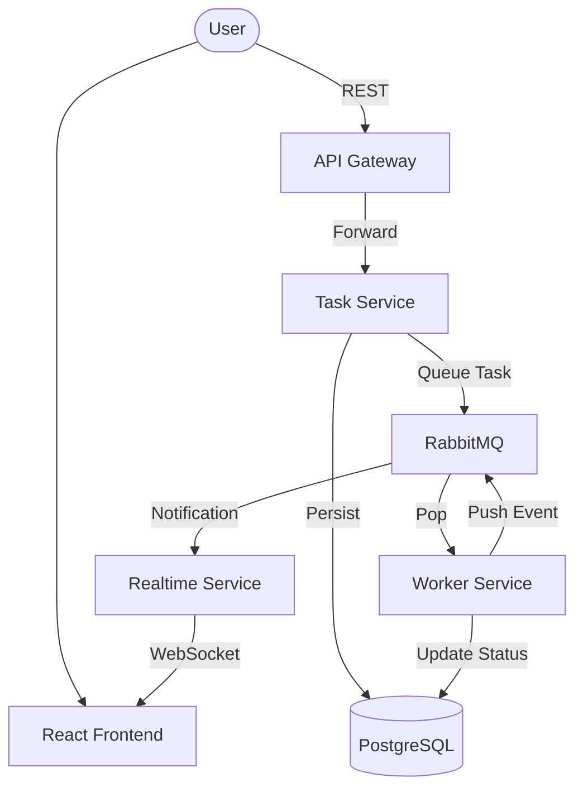

# ⚡ AIFlow

A high-performance, cloud-native microservices platform for processing AI tasks. AIFlow leverages a distributed architecture to provide asynchronous job processing, real-time status updates via WebSockets, and persistent storage for large datasets.

Designed as a **Master's level Cloud Computing project**, it emphasizes architecture complexity, service isolation, and production-grade provisioning.

---

## 🏗️ Architecture Overview

AIFlow is composed of 7 distinct services orchestrated via Docker Compose:

*   **API Gateway**: Unified entry point and request router.
*   **Task Service**: Manages task lifecycle, database persistence, and file uploads.
*   **Worker Service**: Consumes and processes AI tasks (Sentiment, Summarization, etc.).
*   **Realtime Service**: Pushes live status updates to clients using WebSockets.
*   **Frontend**: Modern React dashboard for task management.
*   **PostgreSQL**: Relational storage for task metadata and results.
*   **RabbitMQ**: High-reliability message broker for inter-service communication.



---

## 🚀 Quick Start

### Prerequisites
*   Docker & Docker Compose
*   (Optional) Node.js 20+ for local development

### Deployment
1.  **Clone the repository**:
    ```bash
    git clone https://github.com/your-repo/aiflow.git
    cd aiflow
    ```

2.  **Configure Environment**:
    ```bash
    cp .env.example .env
    ```

3.  **Launch the cluster**:
    ```bash
    docker compose up -d --build
    ```

4.  **Access the Dashboard**:
    Open [http://localhost:5173](http://localhost:5173) in your browser.

---

## 📚 Documentation

Detailed documentation is available in the `docs/` folder:

*   📖 **[Architecture Details](docs/architecture.md)**: Deep dive into the system design and communication patterns.
*   🔌 **[API Guide](docs/api-guide.md)**: Endpoints, request schemas, and usage examples.
*   📦 **[Deployment & Infra](docs/deployment.md)**: Environment variables, healthchecks, and volumes.
*   🛠️ **[Development Guide](docs/development-guide.md)**: How to extend the platform or add new AI models.
*   ✅ **[Verification Procedures](next-step.md)**: Step-by-step guide to testing the full flow.

---

## ✨ Key Features

*   **Asynchronous Scalability**: Decoupled processing allows scaling workers horizontally.
*   **Real-time UX**: Instant feedback via WebSocket event bus.
*   **Fault Tolerance**: Automatic service recovery and health monitoring.
*   **Persistent volumes**: Docker-managed storage for database data and file uploads.
*   **Modular Contracts**: Shared schema definition for consistent inter-service communication.

---

## 🎓 Academic Requirements Compliance

- **Architecture Complexity**: 7 isolated services using standard cloud patterns.
- **Provisioning Code**: Comprehensive `docker-compose.yml` with healthchecks and dependencies.
- **Documentation**: Professional README and technical deep-dives.
- **Deployment Strategy**: Ready-to-run containerized environment.
