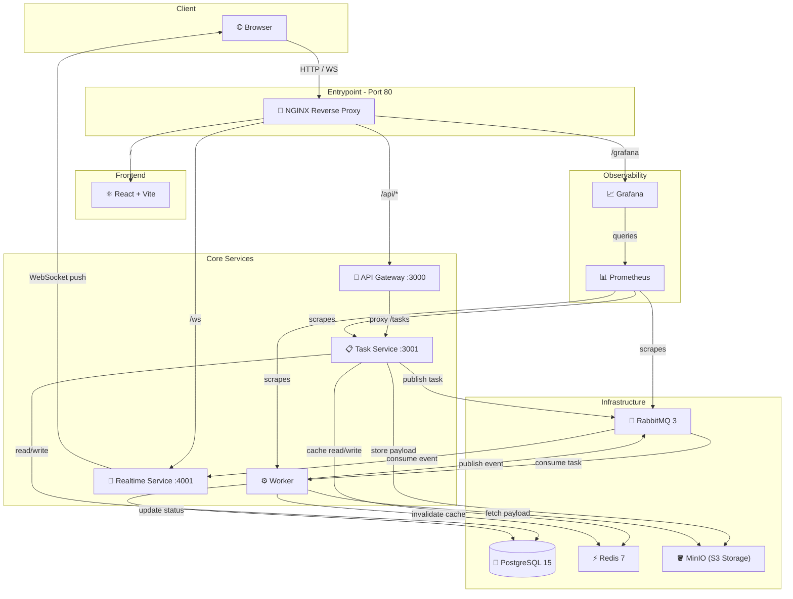

# ⚡ AIFlow

A **cloud-native, distributed AI processing platform** built using a microservices architecture. AIFlow enables asynchronous task execution, real-time feedback, multimodal AI processing, and production-grade observability.

Designed as a **Master’s-level Cloud Computing project**, it demonstrates modern system design principles including **event-driven architecture, resilience patterns, object storage, and full-stack observability**.

---

## 🏗️ Architecture

AIFlow is composed of **13 containerized services**, orchestrated via Docker Compose, with **NGINX as the single entrypoint**.



---

## 🔄 System Flow

```text
Frontend → NGINX → API Gateway → Task Service
                                      ├── PostgreSQL (persist)
                                      ├── Redis (cache / dedup)
                                      ├── MinIO (object storage)
                                      └── RabbitMQ (queue)
                                                ↓
                                            Worker
                                                ↓
                                      RabbitMQ (events)
                                                ↓
                                   Realtime Service
                                                ↓
                                      WebSocket → Frontend
```

---

## 🚀 Quick Start

### Prerequisites

* Docker & Docker Compose

### Launch

```bash
git clone https://github.com/nofa8/AIFlow.git
cd AIFlow

cp .env.example .env

docker compose up -d --build
```

Access:

* App → [http://localhost](http://localhost)
* Grafana → [http://localhost/grafana](http://localhost/grafana)

---

## ✨ Key Features

### 🧠 AI & Processing

| Feature                 | Description                              |
| ----------------------- | ---------------------------------------- |
| **Async AI Processing** | RabbitMQ-based distributed task queue    |
| **Multimodal AI**       | Text, Image, PDF, and URL processing     |
| **External AI APIs**    | HuggingFace + Google Gemini integration  |
| **Fallback Mechanism**  | Automatic fallback to mock AI on failure |

---

### ⚡ Performance & Caching

| Feature                      | Description                               |
| ---------------------------- | ----------------------------------------- |
| **Redis Read-Through Cache** | Task lookup optimization (TTL-based)      |
| **Deduplication Cache**      | Identical inputs return instant results   |
| **Cache Visibility**         | UI shows ⚡ cached responses               |
| **Cache Invalidation**       | Worker clears stale entries on completion |

---

### 🏗️ Architecture & Infrastructure

| Feature                          | Description                                       |
| -------------------------------- | ------------------------------------------------- |
| **Microservices Architecture**   | 13 isolated services                              |
| **NGINX Reverse Proxy**          | Single entrypoint (port 80)                       |
| **MinIO Object Storage**         | S3-compatible distributed file storage            |
| **Docker Compose Orchestration** | Health-based startup dependencies                 |
| **Horizontal Scaling**           | Worker scaling with queue-based load distribution |

---

### 📡 Real-Time System

| Feature                 | Description                                  |
| ----------------------- | -------------------------------------------- |
| **WebSocket Updates**   | Live status: queued → processing → completed |
| **Event-Driven Design** | RabbitMQ event propagation                   |
| **Realtime Service**    | Dedicated broadcast layer                    |

---

### 🛡️ Resilience & Reliability

| Feature                     | Description                                      |
| --------------------------- | ------------------------------------------------ |
| **Dead Letter Queue (DLQ)** | Failed tasks retried with exponential backoff    |
| **Retry Strategy**          | Distributed retry via RabbitMQ, not local loops  |
| **Crash Recovery**          | `process.exit(1)` triggers container restart     |
| **Graceful Shutdown**       | Workers finish in-flight jobs before termination |
| **Channel Guards**          | Prevent DB writes when queue is unavailable      |

---

### 📊 Observability & Monitoring

| Feature                 | Description                                    |
| ----------------------- | ---------------------------------------------- |
| **Prometheus Metrics**  | Task throughput, latency, cache hits, failures |
| **Grafana Dashboards**  | Real-time system visualization                 |
| **RabbitMQ Metrics**    | Queue depth and message rates                  |
| **Per-Service Metrics** | `/metrics` endpoints in core services          |
| **Health Dashboard**    | Frontend system status panel                   |

---

### 🔐 Security

| Feature                    | Description                                     |
| -------------------------- | ----------------------------------------------- |
| **NGINX Security Headers** | XSS, frame protection, MIME sniffing prevention |
| **Presigned URLs**         | Secure MinIO access for images/PDFs             |
| **Input Validation**       | Strict type + size enforcement                  |
| **File Upload Limits**     | Memory-safe upload handling                     |

---

## 📚 Documentation

| Document                                       | Description              |
| ---------------------------------------------- | ------------------------ |
| [Deployment](docs/deployment.md)               | Docker, env, infra setup |


---

## 🎓 Academic Coverage

| Criteria                    | Coverage                                         |
| --------------------------- | ------------------------------------------------ |
| **Architecture Complexity** | 13 services, event-driven microservices          |
| **Distributed Systems**     | Queue-based async processing + DLQ               |
| **Cloud Patterns**          | Object storage (MinIO), caching, observability   |
| **Resilience**              | Retry strategies, fallback logic, crash recovery |
| **Observability**           | Prometheus + Grafana dashboards                  |
| **Scalability**             | Horizontal worker scaling                        |
| **Real-Time Systems**       | WebSocket-based updates                          |

