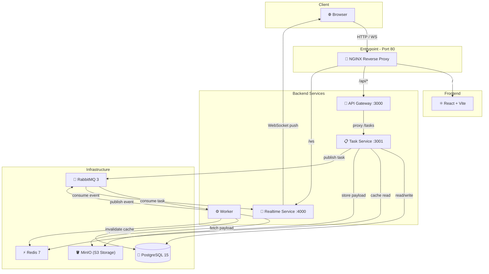

# ⚡ AIFlow

A high-performance, cloud-native microservices platform for processing AI tasks. AIFlow leverages a distributed, event-driven architecture to provide asynchronous job processing, real-time status updates via WebSockets, and intelligent caching with automatic invalidation.

Designed as a **Master's level Cloud Computing project**, it emphasizes architecture complexity, service isolation, and production-grade provisioning.

---

## 🏗️ Architecture

AIFlow is composed of **10 distinct services** orchestrated via Docker Compose, with NGINX as the single entrypoint:



### System Flow

```text
Frontend → NGINX → API Gateway → Task Service → MinIO (object storage)
                                               → PostgreSQL (persist)
                                               → RabbitMQ (publish)
                                                    ↓
                                               Worker (process)
                                                    ↓
                                               RabbitMQ (event)
                                                    ↓
                                               Realtime Service → WebSocket → Frontend (live update)
```

---

## 🚀 Quick Start

### Prerequisites

- Docker & Docker Compose (or Podman)

### Launch

```bash
# 1. Clone the repository
git clone https://github.com/nofa8/AIFlow.git
cd AIFlow

# 2. Configure environment
cp .env.example .env

# 3. Launch all 9 services
docker compose up -d --build

# 4. Open the dashboard
open http://localhost
```

All services will start in dependency order with health checks. NGINX becomes available once all backends are healthy.

### Scale Workers

```bash
docker compose up -d --scale worker=3
```

---

## ✨ Key Features

| Feature | Implementation |
| --- | --- |
| **NGINX Reverse Proxy** | Single entrypoint (port 80), no direct service exposure |
| **Async Processing** | RabbitMQ with durable queues (ai_tasks + task_events) |
| **Real-time Updates** | WebSocket broadcasting: queued → processing → completed |
| **Redis Caching** | Read-through cache (60s TTL) with worker-side invalidation |
| **Horizontal Scaling** | Workers scale with `prefetch(1)` for fair distribution |
| **Health Monitoring** | All services have healthchecks with `service_healthy` dependencies |
| **Security Headers** | X-Content-Type-Options, X-Frame-Options, XSS protection |
| **Input Validation** | Type whitelist, length limits, proper error responses |
| **MinIO Object Storage** | S3-compatible, persistent distributed storage avoiding local volumes |
| **Multimodal AI** | Direct Gemini API integrations for Image, PDF, and URL scraping pipelines |
| **Auto Recovery** | `restart: on-failure` across all services |

---

## 📚 Documentation

| Document | Description |
| --- | --- |
| [Architecture](docs/architecture.md) | System design, Mermaid diagram, communication patterns |
| [API Guide](docs/api-guide.md) | Endpoints, request schemas, usage examples |
| [Deployment](docs/deployment.md) | Environment variables, healthchecks, volumes |
| [Development Guide](docs/development-guide.md) | How to extend the platform |
| [Verification](next-step.md) | Step-by-step testing procedures |

---

## 🎓 Academic Requirements

| Criteria | Coverage |
| --- | --- |
| **Architecture Complexity** | 10 isolated services with resilient event-driven patterns |
| **Provisioning** | Docker Compose with healthchecks, volumes, dependency ordering |
| **Deployment** | Single-command startup, NGINX reverse proxy, horizontal scaling |
| **Documentation** | Architecture diagrams, API guide, deployment guide |
| **Advanced Features** | S3 MinIO storage, Redis caching, Multimodal AI scraping, UI Markdown React logic |
