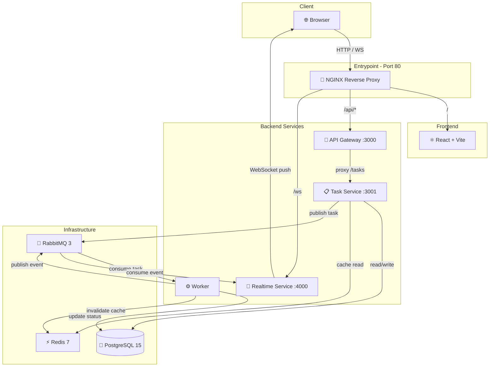

# AIFlow Architecture

## System Diagram



## Services

| Service | Technology | Port | Purpose |
|---------|-----------|------|---------|
| NGINX | Nginx (Latest) | 80 | Central Proxy / Entrypoint |
| Frontend | React + Vite | 5173* | User interface |
| API Gateway | Express.js | 3000* | Routing, auth, proxy |
| Task Service | Express.js + pg | 3001* | Business logic, DB, queuing |
| Worker | Node.js + amqplib | — | AI job processing |
| Realtime Service | ws + amqplib | 4000* | WebSocket notifications |
| PostgreSQL | PostgreSQL 15 | 5432* | Persistent data storage |
| RabbitMQ | RabbitMQ 3 | 5672 | Message broker |
| Redis | Redis 7 | 6379* | Caching + invalidation |

\* *Internal ports only, not exposed — managed behind NGINX proxy.*

## Communication Patterns

### 1. Synchronous (REST)

```
Browser → NGINX :80 → API Gateway :3000 → Task Service :3001 → PostgreSQL / Redis
```

### 2. Asynchronous (Message Queue)

```
Task Service  ──publish──→  RabbitMQ (ai_tasks)   ──consume──→  Worker
Worker        ──publish──→  RabbitMQ (task_events) ──consume──→  Realtime Service
```

### 3. Real-Time (WebSocket)

```
Realtime Service ──WebSocket push──→ Browser (live status updates)
```

## Task Lifecycle

```
queued → processing → completed | failed
```

## Caching Strategy

- **Read-through cache**: `GET /tasks/:id` checks Redis first (60s TTL), falls back to PostgreSQL
- **Cache invalidation**: Worker deletes `task:{id}` from Redis on completion/failure
- **Consistency**: Ensures fresh data after status changes

## Scaling

Workers can be scaled horizontally:

```bash
docker compose up -d --scale worker=3
```

Each worker uses `prefetch(1)` to ensure fair distribution across instances.

## Security

- NGINX security headers: `X-Content-Type-Options`, `X-Frame-Options`, `X-XSS-Protection`, `Referrer-Policy`, `Permissions-Policy`
- Server version hidden (`server_tokens off`)
- No direct service port exposure — all traffic routes through NGINX
